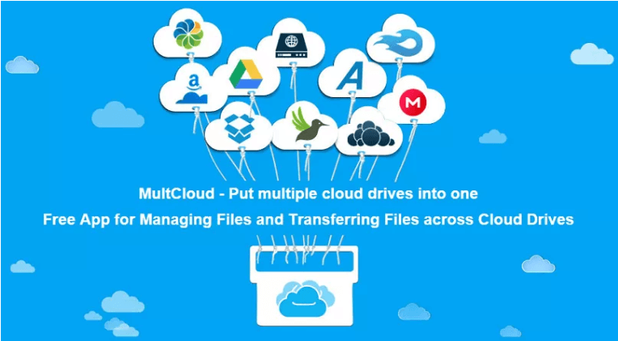
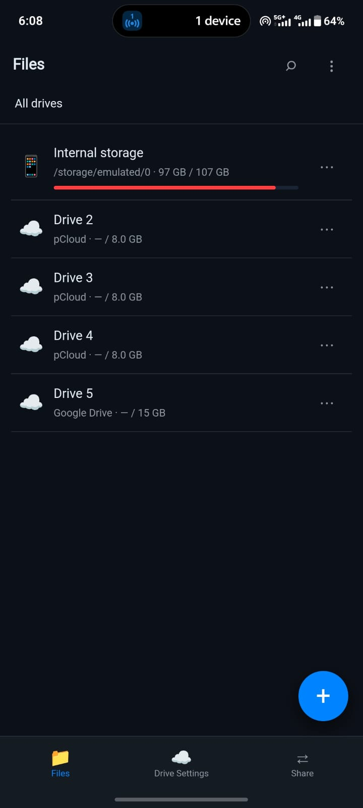
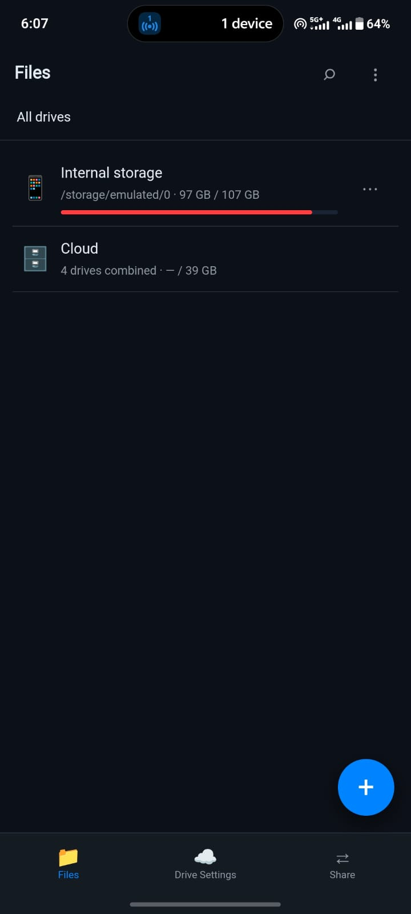
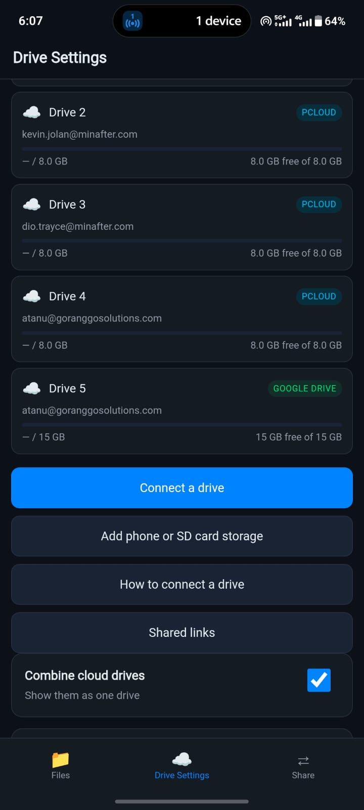

# OmniDrive

[](https://go.dev)
[](LICENSE)
[](https://github.com/atanuroy22/omnidrive/stargazers)

> All your cloud drives — Google Drive, OneDrive, Dropbox, pCloud, TeraBox, WebDAV, S3 — in one mobile web app, served by a **single 6.7 MB binary** that runs on your phone.

No Node. No Docker. No database. No server to rent. Start it in Termux, open `127.0.0.1:8787` in your browser, and it behaves like a normal app.

---

## Overview



OmniDrive unifies every cloud storage provider into a single, consistent file manager. Connect Google Drive, OneDrive, Dropbox, and more — then browse, upload, download, and share files across all of them from one interface.

Works on **Android** (as a native APK), **Windows**, **Linux**, and **macOS** — the same binary, the same UI, the same encrypted account store.

---

## Screenshots

<div style="display:grid;grid-template-columns:repeat(3,1fr);gap:12px">



</div>
<div style="text-align:center;color:#888;font-size:0.85em;margin-top:4px">Android UI — same experience on Windows, Linux &amp; macOS</div>

---

## Features

- **7 cloud providers** — Google Drive, OneDrive, Dropbox, pCloud, TeraBox, WebDAV, S3-compatible
- **Zero dependencies** — pure Go standard library, no third-party packages
- **Encrypted state** — AES-256-GCM for local data, PBKDF2-secured portable bundles
- **One-command device transfer** — pair two phones over Wi-Fi in seconds
- **Upload strategies** — most-free, least-used, round-robin, weighted, or manual
- **Public file links** — one tap to share any file across providers
- **Recycle bin** — cloud deletes are permanent (saves your quota); phone deletes go to a local trash
- **Foreground service** — transfers keep running with the screen off on Android

---

## Quick Start

### Android APK

Build once, install like any app. No Termux needed after that.

```bash
ABI=arm64-v8a bash android/build-apk.sh      # 2.7 MB, 64-bit phones
bash android/build-apk.sh                    # 8.5 MB, all ABIs
```

```bash
adb install -r build/omnidrive-0.1.0.apk
```

Open **OmniDrive** from your app drawer. The **Drives** tab connects accounts; **Move** transfers everything to another phone.

### Termux (Android terminal)

```bash
./build.sh android
termux-setup-storage
bash scripts/install-termux.sh ~/storage/downloads/omnidrive-android-arm64
omnidrive-start
```

Then open http://127.0.0.1:8787 in your browser.

### Desktop (Windows / Linux / macOS)

```bash
./build.sh                                   # builds all targets
./build/omnidrive-linux-amd64                # or windows-amd64, darwin-arm64, etc.
```

Open http://127.0.0.1:8787 — the same UI, no installation required.

---

## Supported Providers

| Provider | Auth method | Setup needed |
|---|---|---|
| Google Drive | OAuth 2.0 | [Google Cloud Console](https://console.cloud.google.com/apis/credentials) |
| OneDrive | OAuth 2.0 | [Microsoft Entra](https://entra.microsoft.com) |
| Dropbox | OAuth 2.0 | [Dropbox Console](https://www.dropbox.com/developers/apps) |
| pCloud | Email + password | None — sign in directly |
| TeraBox | Session cookie | None — **1 TB free** |
| WebDAV | URL + credentials | None — Nextcloud, Yandex, Koofr, NAS, etc. |
| S3 compatible | Access keys | None — AWS, R2, B2, MinIO, Wasabi, Storj |

**No developer account required** for pCloud, TeraBox, WebDAV, and S3. Open the app and connect instantly.

---

## Moving Your Setup to Another Device

Eight accounts connected, new phone — no need to sign in eight times. Everything packs into one encrypted bundle.

### Pair over Wi-Fi (fastest)

```bash
omnidrive pair
```

```
  Pairing 4 drive(s). Paste this one link on the other device:

      omnidrive join "http://192.168.1.42:41235/pair/a3f9c1?c=K3M9P2QX"

  Single use · expires 11:47PM
```

### Store inside a connected drive

```bash
omnidrive push a1b2c3d4 -passphrase "your passphrase"
# On new phone, connect any one account, then:
omnidrive pull a1b2c3d4 -passphrase "your passphrase"
```

### Export to a file

```bash
omnidrive export backup.omnibundle -passphrase "your passphrase"
omnidrive import backup.omnibundle -passphrase "your passphrase"
```

Accounts merge by ID — importing the same bundle twice is safe. Use `-replace` to wipe local accounts first.

---

## Upload Strategies

Upload from a folder and the file goes there. Upload from the root and a strategy picks the drive:

| Strategy | Behaviour |
|---|---|
| `most_free` *(default)* | Drive with the most available space |
| `least_used` | Drive with the least data stored |
| `round_robin` | Rotate evenly across drives |
| `weighted_round_robin` | Rotate proportionally to each drive's weight |
| `manual` | Your explicit priority order |

---

## Security

- **AES-256-GCM** encryption for local state with a random per-device key
- **PBKDF2-SHA256** (210,000 iterations) + AES-256-GCM for portable bundles
- Encryption is context-bound — a bundle cannot be opened as device state or vice versa
- Every write is atomic (temp file + rename) — an OOM kill cannot corrupt your accounts
- Server binds to **127.0.0.1** by default; bind wider with `-addr 0.0.0.0` and it generates a required access token
- Pairing uses a single-use, five-attempt lockout, ten-minute expiry code that is also the decryption key
- All crypto from the Go standard library — no third-party dependencies

---

## Command Reference

```
omnidrive [flags]                 Start the server (default)
omnidrive accounts                List connected drives
omnidrive pair                    Share this setup with another device
omnidrive join <pairing-link>     Receive a setup from another device
omnidrive export <file>           Write an encrypted backup bundle
omnidrive import <file>           Read an encrypted backup bundle
omnidrive push <account-id>       Save the setup into a connected drive
omnidrive pull <account-id>       Restore the setup from a connected drive
omnidrive version
```

**Flags:**

| Flag | Default | Description |
|---|---|---|
| `-data` | `~/.omnidrive` | Data directory |
| `-addr` | `127.0.0.1` | Bind address |
| `-port` | `8787` | Port |
| `-passphrase` | `$OMNIDRIVE_PASSPHRASE` | Bundle passphrase |
| `-device-passphrase` | — | Local state passphrase |
| `-replace` | — | Discard local accounts on import |

---

## Troubleshooting

**Nothing loads, but the phone has internet.**
The Android DNS fix did not engage. Check `curl 127.0.0.1:8787/api/health` — `dnsPatched` should be `true`.

**APK won't install: "App not installed".**
An older copy signed with a different key is still on the device. Uninstall it first. On Android 13+ you may also need to allow your file manager to install unknown apps.

**The app opens but stays on the startup screen.**
Tap **Log**. The server's own output is there — most often port 8787 is already in use.

**Sign-in bounces me to the browser.**
That is deliberate. Google and Microsoft reject OAuth inside embedded WebViews. Finish signing in in your browser, then switch back to OmniDrive — it refreshes automatically.

**The server dies when I switch apps.**
Android 12+ kills background processes. Install `termux-api`, use `omnidrive-start`, pull down the Termux notification and tap **Acquire wakelock**, and exclude Termux from battery optimisation. On heavy-handed OEM builds (Xiaomi, Samsung, Oppo) also lock Termux in the recents screen.

**Google: `Error 400: redirect_uri_mismatch`.**
Create the OAuth client as **Desktop app** instead of Web application — Google accepts loopback redirects on any port with nothing to register. If you must use a Web application client, add this under *Authorised redirect URIs*, byte for byte, no trailing slash:

```
http://127.0.0.1:8787/oauth/callback
```

---

## Building from Source

**Requirements:** Go 1.24+, JDK 17+ (for APK builds), Android SDK with build-tools and `android-36` platform.

```bash
# Build all targets
./build.sh

# Build just Android
./build.sh android

# Build a single target
./build.sh android-arm64

# Build the APK
ABI=arm64-v8a bash android/build-apk.sh
```

The APK is a WebView plus a foreground service. The Go binary runs as a child process inside the service. Four Android-specific details make this work on modern devices:

- The binary ships as `lib/<abi>/libomnidrive.so` — Android only executes from the native library directory since Android 10
- Sign-in opens in your real browser, not the WebView (Google/Microsoft reject embedded OAuth)
- DNS resolution is patched from `getprop net.dns*` with public fallbacks — Android has no `/etc/resolv.conf`
- A `dataSync` foreground service with a partial wake lock keeps transfers running with the screen off

`minSdk 29` (Android 10), `targetSdk 36` (Android 16). The Go binary uses 64 KB segment alignment for 16 KB-page devices on Android 15+.

---

## License

[MIT](LICENSE) — free to use, modify, and distribute.

**Uploads fail on large files.**
Google Drive and OneDrive use resumable/chunked sessions and stream without
buffering. Dropbox switches to a session above 100 MB. S3 is a single PUT, so
very large objects there need a stable connection.

**I forgot a bundle passphrase.**
It is unrecoverable by design. Export a new bundle from a device that still
works.

---

## Layout

```
cmd/omnidrive/          CLI entrypoint, flags, banner
internal/androidnet/    Android DNS resolver fix
internal/vault/         AES-256-GCM + PBKDF2 sealing
internal/store/         encrypted state, atomic writes
internal/provider/      driver interface + six backends + OAuth/PKCE
internal/alloc/         upload allocation strategies
internal/portable/      bundles, LAN pairing, cloud config sync
internal/server/        HTTP API, SSE progress, embedded UI serving
internal/web/dist/      the UI itself (HTML/CSS/JS, no build step)
android/                the APK: WebView activity + foreground service
android/build-apk.sh    Gradle-free APK build
scripts/                Termux installer
```

```bash
go test ./...     # unit + end-to-end tests against an in-process WebDAV server
```

---

## Not implemented

- **MEGA** — its client-side crypto is a substantial project on its own and
  would mean the first third-party dependency. Upstream OmniCloud supports it.
- **Cross-provider move/copy** — you can upload and download, but not move a
  file from Drive to Dropbox in one action.
- **Full-text search and a recents index** — listing is live per folder; only
  starred files are tracked across drives.
- **Multi-user / hosted mode** — this is deliberately single-user and local.
